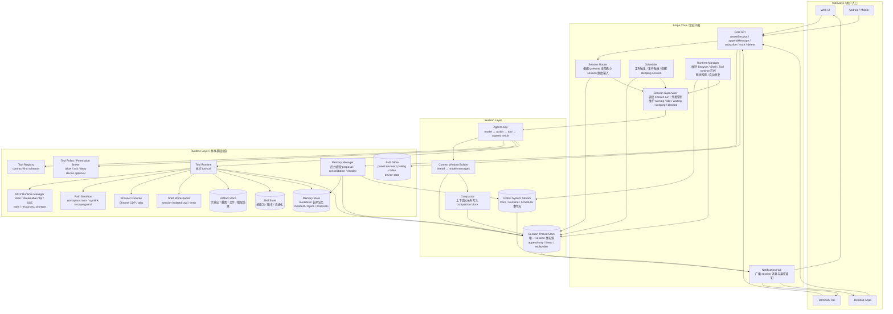
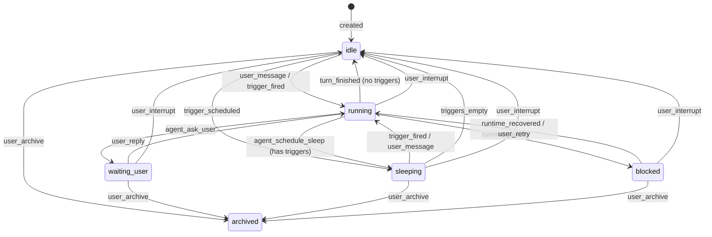
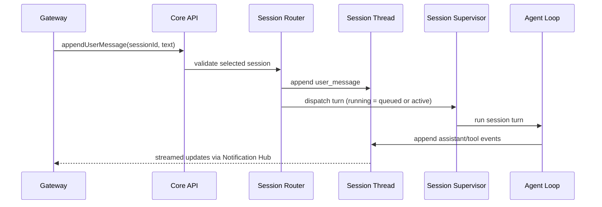
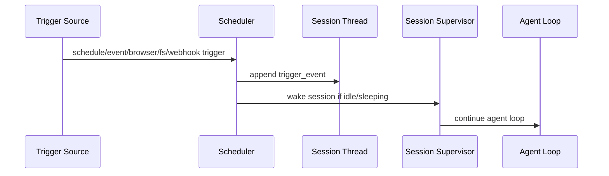
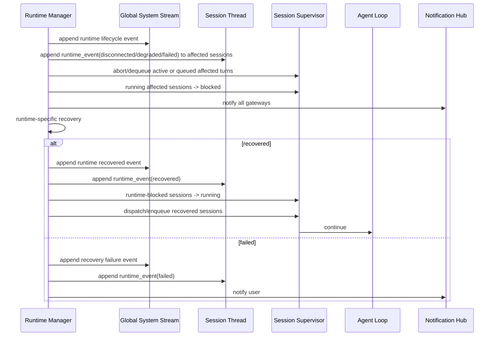

下面是最终高层架构。核心目标是：**常驻 Core + 多 Session + 线性 Thread + 共享 Runtime + 事件驱动调度**。

---

# 1. 总体架构图



---

# 2. 核心抽象

## Forge Core

常驻内核，类似操作系统 kernel。

负责：

```txt
1. 接收所有 gateway 输入
2. 路由到明确 session
3. 调度 session 执行
4. 维护 runtime 健康
5. 处理 trigger
6. 推送通知
7. 记录 global system events
8. 维护后台长期记忆任务状态
```

不负责：

```txt
解释任务语义
替 agent 做业务判断
替 session 决定 retry 策略
```

---

## Session

Session 是永不自然结束的线性线程。

没有 completed / failed 终态。
只有 6 个生命状态 + 1 个终态：

```txt
idle          — 就绪等待，无进行中工作
running       — 已排队或正在执行 turn
waiting_user  — Agent 在 turn 中途等待用户回复
sleeping      — 主动休眠，有定时 trigger 等待唤醒
blocked       — 框架级阻塞断路器，等待自动恢复或人工重试
archived      — 终态，不可逆（用户删除）
```

`turn_finished` 是一次 turn 的内部结果/状态机事件，不是 Session 状态。
普通工具错误不进入 `blocked`：错误 `tool_result` 回到 thread，由 Agent 自己读取并修正。
权限拒绝、审批超时、非交互审批失败、workspace sandbox 拦截也都属于普通工具错误：Core 不替 Agent 判断业务恢复策略，而是在 `tool_result.result` 中写入可读文本，明确说明 tool、requested action、reason、allowed roots / approval fact 和 recovery path。
`blocked` 只用于 Agent 无法靠上下文自修复的 Core / Provider / Runtime / 协议级阻塞。
如果 `running` session 无法被 dispatch（例如缺少 ModelProvider 或 ToolExecutor），Core 会写入可读 `runtime_event` 并转入 `blocked`，避免停留在无法执行的 `running`。
工具大输出不直接写入完整 thread：AgentLoop 会把超过阈值或超过本轮聚合预算的工具输出保存到 Artifact Store，在 thread 中保留合法 `tool_result` 预览并追加 `artifact_pointer`。Agent 可用 `read_artifact` 按 id 读取同 session 的文本 artifact。
进程重启后，Core 使用 `rehydrateAfterStartup()` 做 thread-first semantic recovery：不持久化 supervisor queue，不恢复旧进程中已经死亡的 provider/tool Promise；持久化的 `running` meta 表示旧进程中断的未完成 turn。启动时这些 session 会在修复 thread 后转为 `blocked`，等待用户显式 retry，不自动重新排队抢占当前用户输入。若启动时发现未匹配 `tool_call`，Core 先补写 `isError: true` 的 `tool_result`：`Process restarted before this tool completed.`。

已移除 `paused`：用 `user_interrupt`（任意状态→idle）替代暂停/恢复。对已排队/执行中的 `running` session，interrupt 会 dequeue/abort 当前 turn；中断不是失败，不进入 `blocked`。如果中断发生在 tool call 已写入但 tool 尚未返回时，Core 会补写 `isError: true` 的中断 `tool_result`，防止下一轮上下文出现悬空 tool call。

Session 的事实只存在于：

```txt
Session Thread
```

thread 中包含：

```txt
user_message
assistant_message
tool_call
tool_result
usage_event
trigger_event
runtime_event
permission_request
permission_response
mcp_elicitation_request
mcp_elicitation_response
artifact_pointer
compaction_block
```

---

# 3. Session 状态图



用户可执行操作：

| 操作 | idle | running | sleeping | waiting_user | blocked | archived |
|------|:----:|:-------:|:--------:|:------------:|:-------:|:--------:|
| 发消息 | ✅ | — | ✅(唤醒) | ✅(回复) | — | — |
| interrupt | ✅(no-op) | ✅ | ✅ | ✅ | ✅ | — |
| retry | — | — | — | — | ✅ | — |
| 归档 | ✅ | — | ✅ | ✅ | ✅ | — |

---

# 4. 用户输入路径



规则：

```txt
1. 用户输入必须落到明确 session。
2. Gateway 像 IM：有 session list、selected session、unread、mute。
3. 没有 selected session 时，必须选择或新建。
4. `createSession(title)` 可以创建空草稿，并出现在 session list；没有首条输入就不持久化到磁盘。
5. `appendUserMessage()` 默认把 session 转为 `running` 并自动 dispatch；HTTP `POST /sessions/:id/messages` 不需要客户端再调用 `/run`。
6. `/run` 保留为兼容入口；对已排队/运行中的 session 返回 accepted 类结果。
7. 如果默认 dispatch 发现 Core 缺少必要 provider/executor，用户消息仍保留，随后追加可读 `runtime_event` 并进入 `blocked`。
8. 所有 gateway 共用同一底层数据。
9. HTTP Gateway 是单用户、多设备 Remote Gateway：设备通过 pairing code 换取 device token；token 只返回一次，服务端只存 hash。
10. 每台设备有独立 device state（selected session / read cursor / mute），不会污染 session thread。
11. `/events` 支持 cursor replay；移动端断网后用 thread/system stream 增量补漏，再继续实时 SSE。
12. 本地产品入口是 `forgeagent` CLI：`start/status/stop/restart` 通过 `.forge/run/gateway.json` 管理后台 HTTP gateway；不引入第二套事实源。
```

---

# 4.1 Remote Gateway / 多端协同

```txt
默认模型：single-user / multi-device，不是 SaaS 多租户。
Auth facts 存在 `.forge/auth/` 和 `.forge/device-state/`，不进入 session thread。
Session/thread/system stream 仍是 agent 事实源；device state 只是 gateway UI 状态。
```

HTTP Gateway 规则：

```txt
1. 默认监听 127.0.0.1，显式 HTTP_HOST 才允许外部地址。
2. 私网优先：手机通过 Tailscale / ZeroTier / Cloudflare Tunnel / HTTPS 反代访问。
3. 所有业务 API 默认需要 Authorization: Bearer <device-token>。
4. CORS 默认只允许 localhost origin；FORGE_HTTP_ALLOWED_ORIGINS 可配置 Web origin。
5. 请求体默认 1MB；超限返回 413。
6. pairing code 5 分钟有效、一次性使用；stream token 60 秒有效、一次性使用。
7. 浏览器 EventSource 无法带 Authorization 时，先用 `POST /auth/stream-token` 换一次性 SSE token。
8. `GET /health` 与 `GET /discovery` 免认证，用于本机 CLI、Chrome 扩展自动发现和健康诊断；业务 API 与 SSE 仍默认认证。
9. Gateway 同源服务本地 Web Console：API route 优先，其他 GET/HEAD 由 `web/dist` 处理；无 UI build 时返回可读 HTML 提示，不影响 JSON API。
10. 本地 Web Console 通过 loopback pairing 自动创建 `web` device token，token 只存在浏览器本地存储；远端/移动端仍走 pairing code 或后续客户端实现。
11. DeepSeek provider 配置可由 Web Console 写入 `.forge/config/provider.json`，服务端只返回 masked key 和配置状态；`.env` 仍保留为兼容/启动默认来源。
```

Web Console Beta 规则：

```txt
1. Web Console 是产品壳，不是新的事实源；session thread、system stream、usage ledger、artifact store、memory/skill store 仍由 Core 持有。
2. 中心消息流必须完整呈现 durable event，包括 tool_call/tool_result、permission_request/response、runtime_event、usage_event、context_usage_event、artifact_pointer、skill_used。
3. 权限审批在消息流中完成，不新增 waiting_permission 状态；审批结果写回 Core 后由 AgentLoop 继续。
4. diagnostics 聚合 provider/gateway/Webridge/memory/skills/permissions/session 状态，但不能返回 API key、device token 或其他 secrets。
5. artifact 读取通过 authenticated product API；大输出仍以 artifact_pointer + preview 留在 thread，UI 不把 artifact 内容当 thread 事实源。
```

---

# 4.2 Tool Permission / Workspace Sandbox

ForgeAgent 的工具权限是执行边界，不是生命周期终态。

```txt
1. ToolDefinition 用 capabilities 声明能力：fs.read / fs.write / process.exec / network.http / memory.read / memory.write / scheduler.read / scheduler.write / runtime.browser / artifact.read / user.prompt / mcp.tool / mcp.server.launch / mcp.resource.read / mcp.prompt.read / mcp.sampling / mcp.elicitation。
2. ToolRuntime 在 handler 前统一调用 ToolPolicyManager / PermissionBroker，决策为 allow / ask / deny，优先级 deny > ask > allow > default。
3. ask 会写入 durable permission_request，并通过 HTTP/SSE 推给已配对设备；设备可 allow_once / allow_session / deny。
4. 不新增 waiting_permission。等待审批属于 running turn 的一部分，受现有 interrupt 和 process restart repair 机制约束。
5. 非交互来源（trigger / startup resume / 无 device source）遇到 ask 时 fail-closed，并写 permission_response + 错误 tool_result。
6. denied / timeout / noninteractive / sandbox block 都不进入 blocked；它们作为 isError=true 的 tool_result 回流给 Agent。
7. 错误文本必须给 Agent 足够上下文：Tool、Requested action、Command/Path/URL、Reason、Allowed roots（如适用）、Recovery。
8. permission_request / permission_response 是 durable audit 和 UI 同步事件；模型恢复主要依赖相邻合法 tool_result，避免在 provider tool_call/tool_result 协议中插入额外 system message。
```

# 4.3 WorkspaceActivity / Work Model

ForgeAgent 不引入 `CodingRuntime`。代码能力作为 workspace 能力的高密度场景实现，和文档、浏览器、MCP、Blender、研究、自动化共享同一条 Core/thread/tool/permission/artifact 轨道。

WorkspaceActivity 规则：

```txt
1. WorkspaceActivityManager 只记录状态，不执行工具、不判断权限、不改变 session lifecycle。
2. Scope 是 projectId + sessionId + branchId。read-file cache、diff、diagnostics、checks、background tasks 和 permission grants 都必须按这个 scope 隔离。
3. 新事件包括：activity_event / todo_event / diff_event / diagnostic_event / verification_event / shell_task_event / worktree_event / permission_grant_event。
4. tool_result 仍是 provider tool_call/tool_result 配对的事实；activity events 是额外 durable UI/context facts，不能破坏工具协议。
5. context-window-builder 渲染短 activity facts；system prompt 可注入短 workspace_activity_summary，但最新 user message 和项目文件仍优先。
6. Web/macOS/Android 右侧面板使用 Activity / Work 语义，不使用 Coding 面板，避免把能力收窄成代码产品。
```

编码能力适配：

```txt
1. enter_plan_mode / exit_plan_mode 提供 read-only planning gate；计划阶段只允许 read/search/LSP/git_diff/todo/ask_user，写入、shell、runtime、安装和持久变更会被 PermissionBroker 拒绝为普通工具错误。exit_plan_mode 默认创建 workspace_edits + safe_commands grants，作为安全 workspace autopilot；它不批准 package install、external runtime、network write、destructive action，也不能绕过 PathSandbox hard block 或 explicit deny。
2. todo_write 维护当前计划；同一时刻最多一个 in_progress item，全部完成但尚无通过验证时必须提示 Agent 继续检查。
3. read_file / write_file / edit_file / multi_edit_file / apply_patch_file / revert_file_change 使用 scoped readFileState，避免跨 project/session/branch 污染；read state 必须有 LRU/容量上限，并保留原文件 UTF-8/UTF-16LE BOM 与 CRLF/LF 风格。read_file 对不存在、目录、过大和不支持的二进制文件返回可读 tool_result isError=true；对图片、PDF、Jupyter notebook 返回可读 metadata/summary，避免把真实存在的非文本 workspace asset 误报成普通读取失败。
4. write/edit/multi-edit/patch 成功后写 diff_event；diff_event 优先使用多 hunk 结构，超大 diff 才退回 bounded fallback。可撤销的小/中型文本编辑在同一 diff_event.checkpoint 中记录上一版快照和 after hash；revert_file_change 只能恢复最近一次可验证 checkpoint，且默认拒绝覆盖 checkpoint 之后的新变化。
5. lsp_query / lsp_diagnostics 是 CodeIntelligenceAdapter 的工具面。TypeScript/JavaScript 使用 TypeScript language-service adapter 读取 workspace 内 tsconfig，支持 symbols / workspace_symbols / definition / implementation / references / hover / call_hierarchy / incoming_calls / outgoing_calls 和结构化 diagnostics；Python、Rust、Go、Java、Kotlin、Swift、C/C++、C#、Ruby、PHP 等常见语言先走 generic lexical multi-language code index，提供 symbols / workspace_symbols / definition / references / hover 风格的受限导航，并在输出中声明不是 full semantic LSP。implementation 和 call hierarchy 只由语义 adapter 支持；后续语言可以继续通过真实 language adapter 或 MCP 扩展。主动 lsp_diagnostics 会写 diagnostic_event + verification_event；没有 TS/JS 文件时不能伪装 clean，必须给出可恢复的 verify_workspace / language-specific MCP 路径；编辑 TS/JS 文件后的被动 diagnostics 只写 diagnostic_event，不伪装成完整 verification。
6. file_search 默认使用 session projectRoot 或 active worktree 做模糊路径查找；glob 用于精确路径模式，并优先走 git-aware file index；grep 默认同样绑定 session projectRoot，避免多项目场景搜错目录。grep/glob 调 ripgrep 时必须使用 argv 数组而不是 shell 字符串拼接，并且只接受真实 `rg` 可执行文件，不能把 Claude/Codex wrapper 当作 ripgrep；grep 应支持 content/files/count、context、type、multiline 和 offset/head_limit 分页。
7. git_diff 提供 repo-level status、changed files、diff stat、untracked files 和 bounded patch，是 Review Work 和 Agent 自检的事实入口。
8. workspace_review 是最终 readiness gate：读取 durable activity，输出 ready/not-ready、证据、阻塞项和 recommended next actions；检查 open todos、未验证 diff、失败 checks、failed/stale diagnostics、running background tasks、最近失败 activity，以及最新 diff 后是否存在强验证。LSP diagnostics 是轻量反馈，不足以收尾；强验证必须来自 `verify_workspace` 或 bash 执行的安全 test/typecheck/check/build/lint（含常见 JS/TS、Python、Rust、Go、Swift、JVM、dotnet、Make 检查）。workspace_activity_summary 应提前提示最新 diff 晚于 latest passing check 的 readiness 风险；失败作为普通 tool_result isError=true 回流 Agent。
9. agent_task 提供受限 read-only verify / explore / plan 子模型调用：复用主 ModelProvider 和 usage tracking，可使用 read/search/LSP/git_diff/verify_workspace/workspace_review/task_output 等安全工具，但不能编辑、安装、启动 runtime、询问用户或绕过 PermissionBroker/PathSandbox；不新增 runtime。verify 子任务必须按 skeptical release reviewer 语义处理缺失/过期/过窄证据，并输出 VERDICT: PASS|PARTIAL|FAIL。PARTIAL、FAIL 或缺失/非法 verdict 必须作为普通 tool_result isError=true 回流给主 Agent，同时写 failed activity_event；只有 PASS 可作为完成信号。它是独立审查信号，不替代真实 checks。
10. bash 的测试、typecheck、lint、build 结果写 verification_event；后台 bash 写 shell_task_event，可由 task_output/task_kill 追踪和停止。后台 bash 如果运行的是安全 verification 命令，结束时也必须写 verification_event 和可解析 diagnostics，避免长检查完成后无法被 workspace_review 采纳。前台 bash 命令超过默认 15 秒仍运行时会自动转换为 background shell task 并返回 task id，避免长检查卡住 turn；grep/rg/diff 等命令的非错误退出码不能被误报为工具执行失败。
11. enter_worktree / exit_worktree 创建/恢复/移除 git worktree 并记录 worktree_event；active worktree 会成为后续 turn 的 projectRoot 和 sandbox 根，但不创建独立 runtime。
```

权限收敛：

```txt
1. PermissionGrantManager 能力内聚在现有 ToolPolicyManager / PermissionBroker 中，不新增第二套权限系统。
2. grant 类型包括 workspace_edits / safe_commands / package_install / external_runtime / network_write / destructive_action。
3. Workspace autopilot 只创建 workspace_edits + safe_commands grant；它不等同于 Danger free，不能绕过 hard sandbox、explicit deny、secret exfiltration 或 destructive actions。
4. grouped approval 应写 permission_grant_event，供 UI、审计和下一轮上下文读取。
```

Workspace sandbox 规则：

```txt
1. 文件工具统一经过 PathSandbox resolve/realpath，防止 ..、symlink、non-existing parent escape。
2. 默认 allowed roots 是项目根和 `.forge/workspaces/session_<id>` scratch。
3. read_file / write_file / edit_file / grep / glob 直接使用 sandbox 后的绝对路径。
4. bash cwd 保持项目根，保证构建/测试命令可用。
5. 启用 tool policy 的 Core 会在 macOS 对 bash 使用 Seatbelt/sandbox-exec 约束写入 roots；enforce 模式下 sandbox 不可用则返回可读工具错误，不裸跑。
6. 其他平台 V1 先有统一 policy/path sandbox；bash 进程级强隔离后续补齐。
```

Browser tools 规则：

```txt
1. BrowserRuntime 是 CDP/tab 能力，Agent 通过 built-in tools 使用它，而不是直接调用 runtime API。
2. 内置 browser tools 包括：browser_create_tab / browser_close_tab / browser_navigate / browser_current_page / browser_wait_for_selector / browser_type_text / browser_press_key / browser_click / browser_scroll / browser_extract / browser_extract_links / browser_screenshot。
3. 所有 browser tools 声明 runtime.browser capability；browser_navigate 额外声明 network.http。启用 ToolPolicy 时，这些操作会进入正常审批流，拒绝/超时作为 isError=true tool_result 回流给 Agent。
4. browser tool 失败必须是 Agent 可读文本：缺 runtime、未 attach tab、selector timeout、CDP exception、非 http(s) URL 都要说明 Tool、Requested action、Reason、Recovery。
5. Browser tools 的默认 runtime 是 ForgeWebridge。未显式传 `runtime` 时，工具只请求 `webridge`（或 `FORGE_WEBRIDGE_RUNTIME_NAME` 指定的名字）；如果扩展未安装、未刷新、未配对或未连接，工具返回可读 `isError=true`，说明 bridge 当前 `online / stale / offline` 状态、上次看到扩展的时间和恢复方式。
6. CDP browser runtime 默认不自动触碰用户 Chrome。REPL/HTTP entrypoint 只有在显式设置 `FORGE_BROWSER_CDP_URL` 时才注册 CDP BrowserRuntime，默认 runtime name 是 `chrome`，可用 `FORGE_BROWSER_RUNTIME_NAME` 覆盖。需要使用 CDP 时，Agent 必须显式传入 `{"runtime":"chrome"}` 或对应 runtime 名称。
7. HTTP Gateway 默认注册 `webridge` browser runtime。面向用户的默认安装入口是 `npm run install:local`：它安装 `com.forgeagent.gateway` LaunchAgent，使 gateway 登录自启、崩溃自动拉起，并生成 ForgeWebridge 扩展 zip/release manifest。ForgeWebridge Chrome 扩展通过 `/discovery` 自动发现本机 ForgeAgent，再通过 loopback localhost 自动配对：扩展安装/刷新后会请求 `/auth/pairing-codes` 创建一次性 code，再调用 `/auth/pair` 换取只存于扩展本地的 device token。连接后扩展通过 `/webridge/register`、`/webridge/heartbeat`、`/webridge/commands`、`/webridge/results` 让 Agent browser tools 能操作用户当前 Chrome profile 中的可见登录态页面。Core 端用 `lastSeenAt`、heartbeat 和 long-poll waiter 计算 `/webridge/status`，状态为 `online / stale / offline`；健康变化写入 system stream。旧 token 401/403、gateway 重启后的 stale clientId、临时网络/长轮询错误都应自动恢复，手动 pairing code 只作为 Advanced fallback。诊断入口包括 CLI `npm run doctor`/`npm run logs` 和扩展 popup 的 `Copy diagnostics`，诊断内容不能包含 device token。
8. 对登录态站点，推荐使用 ForgeWebridge 或用户显式准备的 CDP Chrome/profile；ForgeAgent 不读取 cookie/localStorage/password，不做 fingerprint cloaking、验证码绕过、风控规避或批量抓取。遇到登录、验证码、风险确认时，Agent 应使用 ask_user 请求用户处理。
```

MCP Runtime 规则：

```txt
1. MCP 是外部能力接入层，不是第二套 Agent，也不是第二套权限体系。
2. McpRuntimeManager 管理 stdio / streamable-http / legacy SSE server，持久化在 `.forge/mcp/servers.json`、`events.jsonl`、`oauth/`、`cache/`、`catalog-cache/`。
3. MCP server 可以来自本机配置、项目 `.mcp.json`、导入配置或 catalog；项目 `.mcp.json` 默认只发现为 disabled/untrusted，用户 enable 后才导入本机配置。
4. MCP tool 物化为 Forge ToolDefinition，命名为 `mcp__<server>__<tool>`。执行仍走 `ToolRuntime -> PermissionBroker -> Artifact -> Thread`；readOnlyHint 只降低审批风险，不绕过 Forge policy。
5. MCP tool `isError:true`、JSON-RPC error、OAuth/auth failure、timeout、disconnect 都作为普通 `tool_result isError:true` 回流给 Agent，文本包含 server、operation/tool、reason、recovery。普通 MCP 失败不让 session 进入 blocked。
6. MCP runtime lifecycle 写入 `runtime_event(runtimeKind="mcp")` 和 system stream；degraded / needs_auth / catalog_changed 不改变 session lifecycle，除非 Core 自身不可继续。
7. MCP resources/prompts 只通过 utility tools 暴露：list/read resources、resource templates、list/get prompts。resource/prompt 内容是不可信外部上下文，只作为 tool_result 进入 thread，不自动注入 system prompt。
8. roots/list 返回 Forge 当前允许根：project root、session scratch workspace、显式配置 roots。
9. sampling/createMessage 支持但默认关闭。启用时必须经 mcp.sampling 权限，使用当前主 ModelProvider，并写 usage/runtime facts。
10. elicitation/create 接入 durable thread event：mcp_elicitation_request / mcp_elicitation_response。Web/HTTP 设备响应后继续 MCP call；超时或拒绝作为可读工具错误返回。
11. OAuth 2.1 PKCE token 存 `.forge/mcp/oauth/`，owner-only 写入；401 后 server 进入 needs_auth，Web/HTTP/CLI 可重新认证。
12. 管理面：CLI `npm run mcp -- list/add/remove/status/connect/retry/auth/install/doctor/import`；HTTP `/mcp/servers`、`/mcp/tools`、`/mcp/events`、`/mcp/catalog`、`/mcp/oauth/callback`、`/mcp/elicitation/:id/respond`；Web Console 右侧 rail 展示 MCP 状态并支持 enable/disable/retry/auth。
```

---

# 5. Trigger 路径



Trigger 类型：

```txt
time-based
event-based
runtime-recovered
filesystem-change
browser-event
webhook
manual-wake
```

原则：

```txt
所有 trigger 都先进入 session thread。
特别密集的 trigger 可以合并。
idle session 新增 enabled trigger 后进入 sleeping；最后一个 enabled trigger 被删除或取消后，sleeping 自动回 idle。
 Trigger 的业务重试由 Agent 决策并写入 thread；Runtime reconnect/backoff 由 runtime 实现，恢复/失败事实写入 thread 和 system stream。
interrupted 后的 idle session 可由 trigger 正常唤醒；archived session 只记录事件，不自动唤醒。
```

---

# 6. Runtime 修复路径



原则：

```txt
Core 可以接收 runtime 恢复事实并重新调度被该 runtime 阻塞的 session。
具体 reconnect/backoff 属于 runtime 实现，不由 session 状态机表达；BrowserRuntime/CDP 默认 1s 起步、30s 封顶、10 分钟 give-up。
但所有修复事实必须写入 system stream 和相关 session thread。
Runtime attachment 也是 thread 事实：tab attach/detach/re-attach 必须写入 `runtime_event(attached/detached/reattached)`，但不改变 session 生命周期。
Runtime attachment / runtime-blocked ownership 的重启恢复使用 `runtime_event.payload` 中的最小资源身份，不解析 readable `message`。message 仍是人和 Agent 的主要可读事实；payload 只服务于框架恢复 attachment snapshot、重建 runtime-blocked session set，并在 runtime online 后触发自动 dispatch。
agent 恢复后能看到系统发生了什么。
runtime failure 会终止受影响的 active/queued turn；abort 本身不额外写失败事件，阻塞原因来自 runtime_event。
```

---

# 7. 模块设计表

| 模块                         | 职责                               | 关键原则                        |
| -------------------------- | -------------------------------- | --------------------------- |
| **Core API**               | Gateway 统一入口                     | Gateway 不直接写数据库             |
| **Session Router**         | 将输入路由到明确 session                 | 像 IM 选择联系人                  |
| **Session Supervisor**     | 管理 session 运行态                   | 不解释任务语义                     |
| **Scheduler**              | 时间/事件触发，唤醒 session               | trigger 先写入 thread          |
| **Runtime Manager**        | 保持 Browser/Shell/Tool runtime 健康 | 自动修复，事实入流                   |
| **Notification Hub**       | 向所有 gateway 广播                   | 区分 session 消息和 system 消息    |
| **Session Thread Store**   | session 唯一事实源                    | append-only, linear         |
| **Global System Stream**   | core/runtime/scheduler 事件        | append-only, subscribable   |
| **Usage Ledger**           | provider usage/cache/context/cost 持久化 | DeepSeek 真实 telemetry 是事实源 |
| **Agent Loop**             | 单 session 执行循环                   | 极简，不做防呆                     |
| **Context Window Builder** | thread 渲染成模型上下文                  | 纯函数                         |
| **Compactor**              | 用主模型生成结构化 handoff summary 并写入 compaction block | 不是隐藏 snapshot；无启发式 fallback |
| **Tool Registry**          | 工具契约和 schema                     | closed schema               |
| **Tool Runtime**           | 执行工具                             | 结果写回 thread                 |
| **Browser Runtime**        | Chrome/CDP/tabs                  | session 可 attach tab        |
| **Shell Workspace**        | session 简单隔离                     | 每 session 独立 workspace/temp |
| **Artifact Store**         | 大输出和产物                           | tool_result 预览 + pointer 进入 thread |
| **Skill Store**            | 技能生态                             | 显式读取，版本化                    |
| **Memory Store / Manager** | markdown 长期记忆、主动召回、后台 proposal/consolidation | thread 仍是事实源；memory 不替代 session 连续性 |

---

# 8. 数据模型最小集合

```ts
type SessionStatus =
  | "idle"
  | "running"
  | "waiting_user"
  | "sleeping"
  | "blocked"
  | "archived";

type SupervisorEvent =
  | { kind: "user_message" }
  | { kind: "turn_finished" }
  | { kind: "agent_ask_user" }
  | { kind: "agent_schedule_sleep" }
  | { kind: "runtime_failure" }
  | { kind: "user_reply" }
  | { kind: "trigger_fired" }
  | { kind: "trigger_scheduled" }
  | { kind: "triggers_empty" }
  | { kind: "runtime_recovered" }
  | { kind: "user_archive" }
  | { kind: "user_interrupt" }
  | { kind: "user_retry" };

type StreamType =
  | "session_message"
  | "session_internal"
  | "core_system";

type SessionEvent =
  | UserMessage
  | AssistantMessage
  | ToolCall
  | ToolResult
  | UsageEvent
  | TriggerEvent
  | RuntimeEvent
  | PermissionRequest
  | PermissionResponse
  | ArtifactPointer
  | CompactionBlock;

type Session = {
  id: string;
  title: string;
  status: SessionStatus;
  muted: boolean;
  createdAt: string;
  updatedAt: string;
};

type RuntimeAttachment = {
  sessionId: string;
  kind: "browser_tab" | "shell_workspace" | "tool_runtime";
  runtimeId: string;
  metadata: Record<string, unknown>;
};

type Trigger = {
  id: string;
  sessionId: string;
  kind: "time" | "event" | "runtime" | "webhook" | "manual";
  schedule?: string;       // cron 表达式或 ms 间隔
  nextFire?: number;        // 下次触发时间（epoch ms）
  payload: Record<string, unknown>;
  enabled: boolean;
  recurring: boolean;       // 是否为重复触发
};

type MemoryType =
  | "instruction"
  | "profile"
  | "project"
  | "procedure"
  | "episode";

type MemoryStatus =
  | "active"
  | "stale"
  | "archived";

type MemoryEntry = {
  id: string;
  type: MemoryType;
  title: string;
  content: string;           // markdown 正文
  tags: string[];
  status: MemoryStatus;
  sources: string[];         // session/event/path 等可读来源
  path: string;              // topics/<type>/<id>.md
  createdAt: string;
  updatedAt: string;
};

type MemoryProposal = {
  id: string;
  sessionId: string;
  status: "pending" | "rejected" | "promoted";
  candidate: {
    type: MemoryType;
    title: string;
    content: string;
    tags: string[];
    sources: string[];
  };
  createdAt: string;
};
```

---

# 9. 当前目录结构

```txt
src/
  core/
    core-api.ts              — CoreAPI: session CRUD, turn 执行, interrupt/retry
    session-supervisor.ts    — 状态机 transition() + SessionSupervisor 并发队列
    scheduler.ts             — Trigger 管理, cron 调度, 持久化
    runtime-manager.ts       — Browser runtime 健康检测与恢复
    notification-hub.ts      — Session/System/SessionList 事件广播
    cron-parser.ts           — 5-field cron 表达式 + ms 间隔解析
    logger.ts                — 结构化日志 (LOG_LEVEL 控制)
    http-client.ts           — fetchWithRetry (指数退避)
    env.ts                   — 共享 .env 加载

  config/
    provider-config-store.ts — 本地 DeepSeek provider 配置 + masked setup status

  streams/
    session-thread-store.ts  — append-only JSONL 持久化
    system-stream-store.ts   — 全局系统事件流
    event-types.ts           — SessionStatus, SessionEvent, SupervisorEvent

  agent/
    agent-loop.ts            — model → tool → result 循环 (max 50 iter)
    context-window-builder.ts— thread events → model messages (纯函数)
    compactor.ts             — 上下文压缩 (compaction block)
    model-provider.ts        — ModelProvider 接口
    tool-executor.ts         — ToolExecutor 接口
    system-prompt-builder.ts — 构建系统提示 (含状态/调度信息)
    deepseek-provider.ts     — DeepSeek API provider + usage/cache telemetry
    anthropic-provider.ts    — Anthropic-兼容 API provider
    openai-provider.ts       — OpenAI-兼容 API provider

  usage/
    usage-ledger.ts          — usage JSONL ledger + session summary

  mcp/
    runtime-manager.ts       — MCP client runtime, reconnect/backoff, tool/resource/prompt projection
    config-store.ts          — `.forge/mcp` servers/events/cache/catalog persistence + `.mcp.json` discovery
    oauth.ts                 — OAuth 2.1 PKCE provider/store for HTTP MCP servers

  tools/
    tool-registry.ts         — 工具注册表 (contract-first schemas)
    tool-runtime.ts          — 工具执行 runtime + policy preflight
    schemas.ts               — ToolDefinition, ToolCapability, buildTool()
    built-in/                — 内置工具
      bash-tool.ts, read-file.ts, write-file.ts, edit-file.ts
      glob.ts, grep.ts, web-fetch.ts, web-search.ts
      memory-add.ts, memory-search.ts, memory-get.ts, memory-shared.ts
      cron-create.ts, cron-list.ts, cron-delete.ts, scheduler-shared.ts
      ask-user.ts, read-artifact.ts

  permissions/
    tool-policy.ts           — ToolPolicyManager / PermissionBroker / readable denial text

  sandbox/
    path-sandbox.ts          — workspace path confinement / symlink escape guard

  runtimes/
    browser/                 — Chrome CDP 控制
      browser-runtime.ts, cdp-client.ts, tab-manager.ts
    shell/
      shell-workspace.ts     — session 隔离工作目录

  artifacts/
    artifact-store.ts        — 大产物存储 + pointer

  skills/
    skill-store.ts           — 本地/项目/远端/generated skill package store, active pointer, manifest/index/cache
    skill-catalog.ts         — 兼容旧 SkillCatalog API 的 prompt/index view
    skill-scanner.ts         — 静态 scan/quarantine/size/path/symlink 安全边界
    skill-evolution-manager.ts — 后台 skill proposal / no-tools judge / generated overlay / degraded backoff

  memory/
    memory-store.ts          — markdown 长期记忆 (MEMORY.md / topics / proposals / index)
    memory-manager.ts        — 后台 extractor / consolidator / degraded backoff

  gateways/
    gateway.ts               — Gateway 接口
    cli/cli-gateway.ts       — CLI 包装器 (session/unread 管理)
    http/                    — Remote Gateway: device auth + HTTP REST + SSE
      app.ts, http-gateway.ts, http-server.ts, main.ts, pair.ts, run-state.ts
      http-server.ts         — JSON API / SSE / setup / diagnostics / static Web Console
    ../cli/
      forgeagent.ts           — 本地产品 CLI: start/status/stop/restart
      mcp.ts                  — MCP list/add/remove/status/connect/retry/auth/install/doctor/import
    repl/                    — 交互式 REPL
      repl-gateway.ts, main.ts

  auth/
    auth-store.ts            — paired devices / pairing codes / stream tokens / device state

web/
  src/                       — React 本地 Web Console
  dist/                      — `npm run ui:build` 生成的同源 UI 产物
```

---

# 10. 最重要的架构红线

```txt
1. 当前 session 连续性只靠 Session Thread。
2. 不存在隐藏 snapshot 作为事实源。
3. Gateway 只是显示和输入层。
4. Core 调度，但不解释任务语义。
5. Runtime 可共享，但 attachment/reattachment 必须写入 thread。
6. Trigger、runtime 变化、用户输入都以事件进入 thread。
7. 长期 Memory 不用于恢复当前 session；当前 session 连续性只靠 thread、compaction block 和 restart repair。
8. Skills 是显式资源，通过短 manifest 暴露，通过 read_file 渐进式披露，不做 skill_load/skill_list/skill_search model-facing 工具。
9. 大输出进入 Artifact；thread 保留 tool_result 预览和 artifact_pointer，Agent 可用 read_artifact 继续读取。
10. Session 不自然结束，只有 6 个生命状态 + 1 个终态：idle/running/waiting_user/sleeping/blocked/archived。
11. web_search 仅服务器端实现，不做客户端 fallback。
12. API 重试在 provider 层（指数退避），AgentLoop 只处理最终失败。
13. 所有用户对 session 的控制操作（interrupt/retry/archive）通过统一状态机约束。
14. Memory proposal 是内部 staging，由后台 consolidation 自动处理，不作为用户审批队列。
15. HTTP 远程访问必须走可撤销设备身份；固定全局 token 不是主路径。
16. 工具权限和 workspace sandbox 是统一执行边界；拒绝、超时、沙盒拦截作为可读 tool_result 回流给 Agent，不进入 blocked。
17. Skill proposal 是内部 staging；自演化只生成 generated overlay，不原地改写 official/community 上游包，失败 degraded/backoff，不阻塞前台 session。
18. Web Console 是 Gateway 产品壳，不是事实源；provider setup、permission approval、usage/context、artifact 等都必须通过 Core/HTTP 契约落地。
19. MCP 是 Forge ToolRuntime 的外部工具来源，不是独立 agent/runtime 权限旁路；MCP tool/resource/prompt/sampling/elicitation 必须走现有权限、artifact、thread、usage 和 system stream 契约。
```

## 11. 设计哲学补充

### 状态机设计原则

- **只用有价值的状态**：每个状态必须有明确的进入条件、存在意义和退出路径。删除了 `paused`——用 `user_interrupt`（任意状态→idle）替代暂停/恢复，语义更清晰且不会产生孤立状态。
- **状态转移必须全部可达**：状态机中定义的状态和转移，必须在代码中有对应的触发路径。不存在「预留将来用」的孤立转移。
- **sleeping 是自动分流**：turn 完成后根据是否有 enabled trigger 自动决定进 idle 还是 sleeping，不需要 agent 显式调用。
- **trigger 状态同步**：idle session 新增 enabled trigger 立即进入 sleeping；sleeping session 删除最后一个 enabled trigger 立即回 idle。

### 工具与技能设计原则

- **工具暴露给 Agent**：调度、记忆、文件操作等能力通过内置工具暴露，Agent 自行决定何时使用。
- **长期记忆主动召回**：新 session 只注入 memory 使用规则、`instruction` memory 和短 manifest；profile/project/procedure/episode 正文必须通过 `memory_search` / `memory_get` 主动读取。
- **后台记忆维护自动化**：turn 结束后 MemoryManager 可用主 `ModelProvider`、禁用工具，从 thread 提取 proposals 并 consolidation 到 markdown memory。proposal 是内部 staging，不需要用户审批；后台失败写 memory runtime/system 事件并 degraded/backoff，不阻塞前台 session。
- **渐进式技能披露**：系统提示只渲染 active skills 的短 manifest，并按 project/generated/local/official、路径匹配、关键词相关性、最近使用和预算排序。Agent 通过 `read_file` 按需读取 `SKILL.md` 和 package 内引用文件；读取 active skill 文件会写入 durable `skill_used` 事件。仍不做 `skill_load`/`skill_list`/`skill_search` model-facing 工具。
- **技能生态自动化**：`SkillStore` 管理 `.forge/skills/installed|generated|proposals|eval-runs|registry-cache|archive`，兼容 legacy `<name>/SKILL.md`。远端 registry 逐文件下载并校验 sha256，签名源可启用，显式 trust-unsigned 的安装默认 quarantine。`SkillEvolutionManager` 在 turn 后用主 `ModelProvider`、禁用工具生成 proposal，经 static scan、no-tools judge 和 eval 后才自动启用 generated overlay；失败写 skill runtime/system 事件并 degraded/backoff，不 blocked 前台 session。
- **MCP 统一投影**：MCP tools/resources/prompts 不直接改变 system prompt，也不拥有独立审批逻辑；它们被投影为 Forge tools，通过 `mcp__<server>__<tool>`、utility tools 和可读 `tool_result` 渐进披露给 Agent。MCP server 输出全部视为不可信外部上下文。
- **服务端能力不 fallback**：`web_search` 依赖 Anthropic 服务端类型，不开发客户端替代实现。

### 容错设计原则

- **API 重试在 provider 层**：`fetchWithRetry` 封装指数退避，429 优先读 Retry-After header。AgentLoop 不关心重试细节。
- **blocked 是断路器**：普通工具错误回到 Agent；Core / Provider / Runtime / 协议级阻塞才进入 blocked。由 runtime 导致的 blocked 可在 runtime recovered 后自动重新调度，其他 blocked 依赖用户 `retryBlockedSession()` 或 interrupt。
- **MCP 失败可恢复**：MCP server 启动失败、断连、OAuth needs_auth、工具错误和协议错误默认都写成 Agent 可读的 tool_result 或 runtime_event，不替 Agent 做业务推断；只有 Forge Core 本身不可继续才进入 blocked。
- **compaction 是框架级能力**：上下文过长时，AgentLoop 使用当前主 `ModelProvider`、禁用工具，生成结构化 handoff summary。Compaction block 是历史参考，不是当前指令；最新用户消息优先。Compaction 失败不做启发式摘要 fallback，直接写可读 `runtime_event` 并进入 `blocked`。
- **DeepSeek usage 是上下文事实源**：DeepSeekProvider 使用 `/v1/chat/completions` 并在 streaming 时请求 `stream_options.include_usage=true`。Core 把真实 `input/output/total/cache hit/cache miss/reasoning` 写入 UsageLedger 和 `usage_event`；context used%、cache hit rate、cost、compaction 触发都基于真实 usage。DeepSeek usage 缺失是 provider telemetry failure，进入 `blocked`，不使用估算 fallback。估算只允许给 legacy provider，并显式标记 `estimated=true`。
- **interrupt 是通用逃生舱**：任何非终态都可以 interrupt 回到 idle；对 queued/active turn 会通过 `AbortSignal` 和 supervisor dequeue 阻止后续事件写入。若已存在未完成的 tool call，Core 补写可读中断 `tool_result`，防止 session 卡死或上下文不合法。

这张图可以作为后续开发的顶层设计基准。
